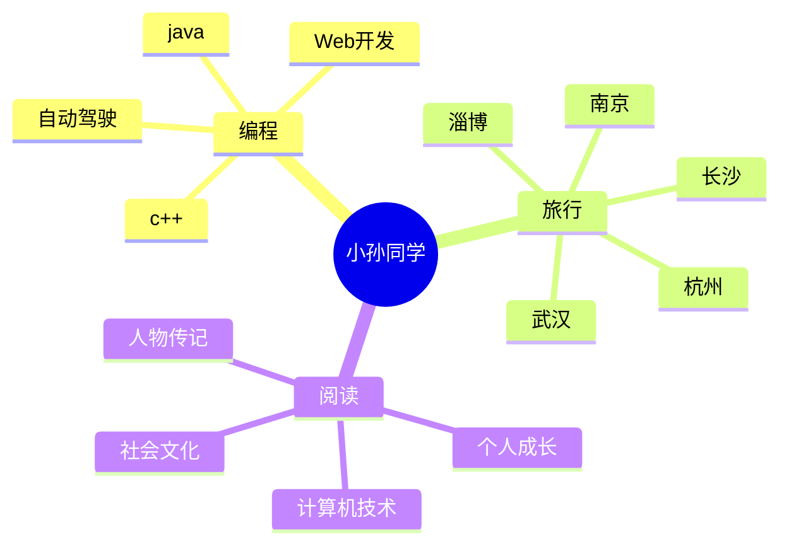

### Hi there 👋

<!--
**sunshengling** is a ✨ _special_ ✨ repository because its `README.md` (this file) appears on your GitHub profile.

Here are some ideas to get you started:
  -->

### This is sunshengling!

🔭Welcome to my GitHub page. 👯System.out.println("Study diligently and strive for improvement every day")

<!-- Snake Code Contribution Map 贪吃蛇代码贡献图 -->

<picture>
  <source media="(prefers-color-scheme: dark)" srcset="https://cdn.jsdelivr.net/gh/sun0225SUN/sun0225SUN/profile-snake-contrib/github-contribution-grid-snake-dark.svg" />
  <source media="(prefers-color-scheme: light)" srcset="https://cdn.jsdelivr.net/gh/sun0225SUN/sun0225SUN/profile-snake-contrib/github-contribution-grid-snake.svg" />
  
</picture>

&emsp;&emsp;大家好，我是小孙同学。

&emsp;&emsp;热爱编程、看电影、读书、旅行。

&emsp;&emsp;热爱计算机科学和IT互联网事业，励志成为一名优秀的开发者。

&emsp;&emsp;我们正在让这个世界变得更加美好，通过代码的重复使用和延展构建完美体系。

<strong>&emsp;&emsp;We're making the world a better place. Through constructing elegant hierarchies for maximum code reuse and extensibility.</strong>

#### :computer: 编程语言和工具：

<code></code>
<code></code>
<code></code>
 
<code></code>
<code></code>
<code></code>
 
<code></code>
<code></code>
<code></code>

